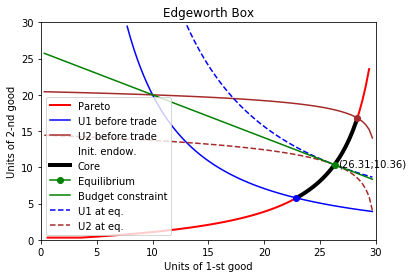
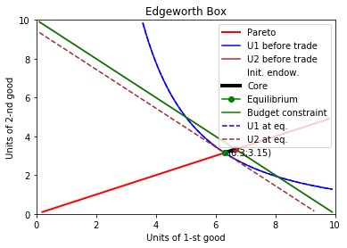

[](https://travis-ci.org/maxlit/pyEdgeworthBox)
[](https://mybinder.org/v2/gh/maxlit/pyEdgeworthBox/master?filepath=README.ipynb)

# How to use it

If you work with docker, launch the jupyter notebook from the command line as follows

```bash
docker pull axlit/edgebox
docker run -p 8888:8888 axlit/edgebox
```

copy the link from the command line and then navigate to /powerindex/README.ipynb notebook in the browser.

pyEdgeworthBox provides with a tool to plot the [Edgeworth box](https://en.wikipedia.org/wiki/Edgeworth_box) and calculate equilibrium, core, pareto effective allocation etc in the pure exchange economy. These are studied in the microeconomics courses. A pure exchange economy consists of 2 consumers and 2 goods. Each consumer has her own preferences represented by a utility function and provided with some initial endowment of 2 goods (wich, however, could be 0). 

The main class is EdgeBox where you need to put the utilities of each consumer and their initial endowments. Consider an economy where the first consumer has a utility function $u(x,y)=x^{0.6}*y^{0.4}$ and the bundles of goods A and B (10,20), i.e. she prefers the good A over B. The second consumer has a utility function $u(x,y)=x^{0.1}*y^{0.9}$ and the bundles of goods A and B (20,10), i.e. he prefers the good B over A.

This example can be calculated like this:


```python
#!pip install pyEdgeworthBox
%matplotlib inline
import pyEdgeworthBox as eb
EB=eb.EdgeBox(  u1 = lambda x,y: x**0.6*y**0.4
              , u2 = lambda x,y: x**0.1*y**0.9
              , IE1 = [10,20]
              , IE2 = [20,10])
EB.plot()
```





Another example:


```python
EB2=eb.EdgeBox(  u1 =lambda x,y: x**2*y
               , u2=lambda x,y: x+y
               , IE1=[5,5]
               , IE2=[5,5])
EB2.plot()
```





# Input arguments

**u1** - utility function of the 1st participant

**u2** - utility function of the 2nd participant

**IE1** - initial endowment of the 1st participant (of the good X and good Y)

**IE2** - the same for the 2nd participant

This means that the preferences and endowments are enough to determine the rest (prices, equilibrium etc).

# Solution concepts

The object of the class *EdgeBox* contains the following properties that correspond to certain concepts of microeconomics/game theory.

Some of them are a point or a set of points, and some are functions.

## Set of points

The following concepts are set of points used to draw the line, i.e. they might not contain all possible solutions (e.g. usually the case for the contract curve), however, some might (e.g. the equilibrium).

**CORE** - [Core](https://en.wikipedia.org/wiki/Core_(game_theory))

**PARETO** - [Contract curve](https://en.wikipedia.org/wiki/Contract_curve), or efficient frontier or the set of Pareto efficient points

**EQ1** - [Competitive (Walrasian) equilibrium](https://en.wikipedia.org/wiki/Competitive_equilibrium) solution of the 1st participant

**EQ2** - the same for the 2nd participant

**BUDGET** - Budget line.

**p** - price at equilibrium point.

**p_weighted** - normalized (i.e. s.t. the sum of its components is 1) price at equilibrium point.

The relation between the concepts is the folloiwng: EQ is in CORE is in PARETO.

Note that they don't contain all possible points only some of them.

## Functional forms

The properties below are in the functional form, i.e. you need to provide with the input argument(s).

**MRS1** - [Marginal rate of substitution](https://en.wikipedia.org/wiki/Marginal_rate_of_substitution) of the 1st participant. 

**MRS2** - the same for the 2nd participant.

**Bp** - budget line.

**_pareto** - Pareto solutions.

# Caution

The computation is implemented only for the interior solutions! For "bad" functions solutions could deviate or not be achieved at all.

# Install

*pip install pyEdgeworthBox*
